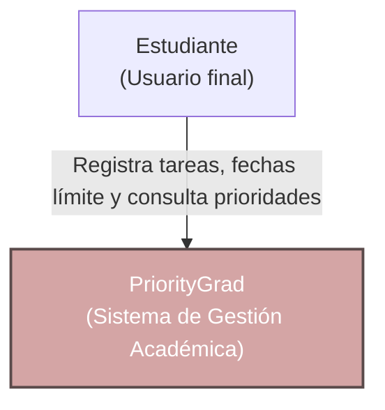

# Diagrama C4 Nivel 1 — Contexto

**Para quién es:** Usuarios no técnicos, profesores evaluadores y stakeholders.
**Qué responde:** Muestra el panorama general del sistema y su interacción directa con el usuario final.

