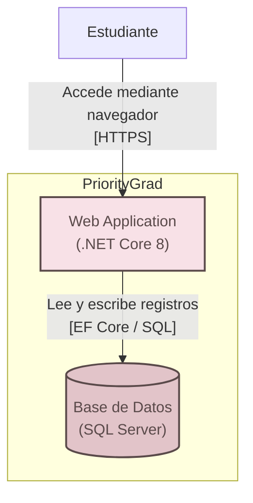

# Diagrama C4 Nivel 2 — Contenedores

**Para quién es:** Arquitectos de software y líderes técnicos.
**Qué responde:** Identifica las piezas ejecutables del software y cómo se comunican entre sí.

```mermaid
flowchart TD
    Usuario[" Estudiante"]

    subgraph Sistema ["PriorityGrad"]
        WebApp[" Web Application\n(.NET Core 8)"]
        DB[(" Base de Datos\n(SQL Server)")]
    end

    Usuario -- "Accede mediante navegador\n[HTTPS]" --> WebApp
    WebApp -- "Lee y escribe registros\n[EF Core / SQL]" --> DB

    style WebApp fill:#f8e1e7,stroke:#5a4a4a,stroke-width:2px,color:#5a4a4a
    style DB fill:#e2c4c9,stroke:#5a4a4a,stroke-width:2px,color:#5a4a4a
```