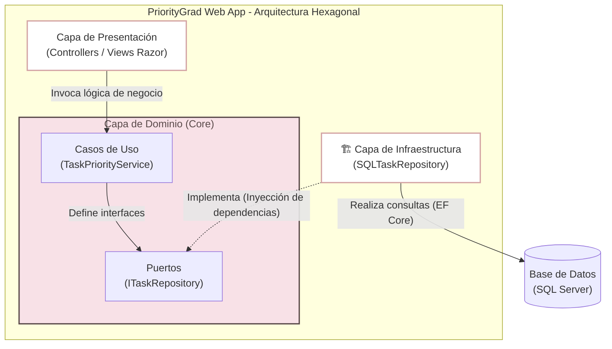

# Diagrama C4 Nivel 3 — Componentes

**Para quién es:** Desarrolladores encargados de la implementación del código.
**Qué responde:** Describe la estructura interna de la aplicación aplicando Arquitectura Hexagonal y separación de responsabilidades.

